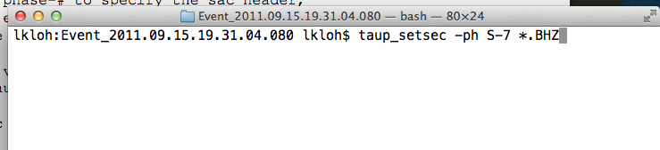
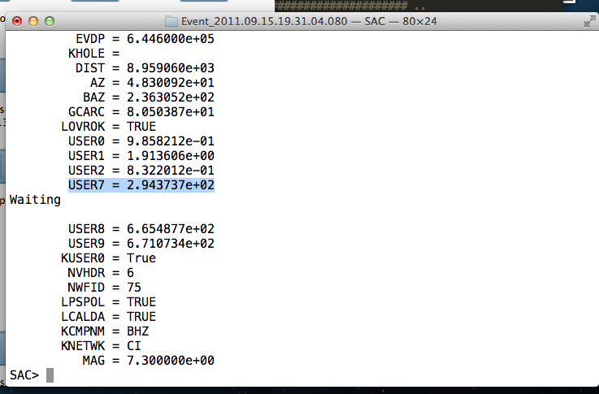

=====================
Computing Delay Times
=====================

Note: Not relevant to the functionality of AIMBAT, but added in case users want to compute delay times.

You will need `TauP <http://www.seis.sc.edu/software/TauP/>`_ for this.

#. After getting all your SAC data files you want to run AIMBAT on, run ``taup_setsac`` to set t0 according to event and station locations. For instance, inside the folder ``Event_2011.09.15.19.31.04.080`` in the `data-examples <https://github.com/pysmo/data-example>`_ folder, run::

	taup_setsac -ph S-7 *.BHZ

to write the `t0` value for seach SAC file into the `user7` variable. 

#. Bundle the SAC files into a PKL file and run ``ttpick.py`` on it to pick the arrival times. The relative arrival times (relative to the average arrival time) is given in the second column (``mccc delay``) of the resultant mcp file. 

.. image:: delay-times/mcp_output

The average arrival time is found at the bottom of the mcp file. To find the absolute arrival time for a station, add the value of its ``mccc delay`` in the correponding second column to the average arrival time. 

#. To find the delay time, subtract the `t0` value obtained from running `taup` from the actual arrival time, obtained earlier by adding the average arrival time and the mccc delay time in the mcp file. 

