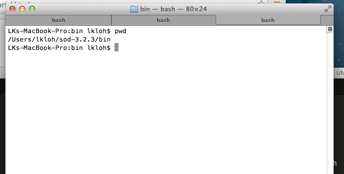

============
Getting Data
============

There are several ways to obtain seismic data from `IRIS <http://www.iris.edu/dms/nodes/dmc/data/types/waveform-data/>`_ to input to AIMBAT. The authors used two ways to do it, and a further list of libraries for obtaining seismic data is provided in the sidebars `here <http://www.iris.edu/dms/nodes/dmc/data/types/waveform-data/>`_. 

.. ############################################################################ ..
.. #                           OBSPY CLIENT FDSN                              # ..
.. ############################################################################ ..

Obspy.fdsn for downloading data
-------------------------------

Installing Obspy
~~~~~~~~~~~~~~~~

We recommend using Macports to install Obspy as detailed in the `Installation` section `here <https://github.com/obspy/obspy/wiki>`_.

Using Obspy
~~~~~~~~~~~

Use the `Obspy FDSN <http://docs.obspy.org/packages/obspy.fdsn.html#>`_ Web service client for Obspy in Python. Once you have done so, check out the `SAC-Input Output <http://docs.obspy.org/packages/obspy.sac.html>`_ libraries for loading the data to Python and saving it as SAC or Pickle files. 

.. ############################################################################ ..
.. #                           OBSPY CLIENT FDSN                              # ..
.. ############################################################################ ..

.. ############################################################################ ..
.. #                        STANDING ORDER FOR DATA                           # ..
.. ############################################################################ ..

Standing Order for Data
-----------------------

From the `SOD <http://www.seis.sc.edu/index.html>`_ website:

    Standing Order for Data, is a framework to define rules to select seismic events, stations, and data. It then allows you to apply processing to the events, stations, and data and currently contains a large set of rules that allow you to select with great precision in these items. The processes mainly consist of simple data transformation and retrieval, but SOD defines hooks to allow you to cleanly insert your own processing steps, either written in Java or an external program.

Installing SOD
~~~~~~~~~~~~~~

First, download `SOD <http://www.seis.sc.edu/index.html>`_.

Once you have gotten the folder for SOD, put it somewhere where you won't touch it too much. What I did was put the SOD folder in my home directory, though other places are acceptable as well, as long as its not too easy to delete it by accident.

.. image:: sod-images/sod_location.png

Once you have it there, get the path to the sod folder's bin and put it in your path folder. 

Inside my home directory's bash profile (you get the by typing `cd`), you put the path to `sod-3.2.3/bin` by adding in either the `bash` or `bash_profile` or `profile` files: 

Downloading Data with SOD
~~~~~~~~~~~~~~~~~~~~~~~~~

:Authors: 
	`Trevor Bollmann <http://www.earth.northwestern.edu/~trevor/Welcome.html>`_

#. Create a sod recipe and place it in the folder that you would like the data to download to.
    - :code:`sod -f <recipename>.xml`
#. Run :code:`sodcut.sh` to cut the seismogram around phase wanted
    - check model within :code:`cutevseis.sh`
    - run using :code:`sodcut.sh <name>`
    - watch :code:`sdir = processed seismograms`
    - Run over the entire downloaded directory (the files sod downloaded)
#. Run :code:`sodpkl.sh` (converts `.sac` files to python pickles)
    - run using :code:`sodpkl.sh [options] <directory>`
    - output will automatically be zipped
    - run in DATA directory
#. Run :code:`ttpick.py` (does travel time picking with plotting)
    - can use :code:`iccs.py` but it does not have plotting capabilities
    - run using :code:`ttpick.py [options] <pkl.gz file>`
    - do this one event at a time
    - use :code:`sacp2` to look at the stacking of the seismograms
    - you can sort the seismograms using the :code:`–s` flag
#. run :code:`getsta.py` (creates a :code:`loc.sta` file)
    - :code:`getsta.py [options] <pkl.gz files>`
#. Run EITHER of these: 
	- FIRST CHOICE	
    
    run :code:`mccc2delay.py` (converts mccc delays to actual delays) by doing :code:`mccc2delay.py [option] <.mcp files>`
    
    run :code:`getdelay.py` (creates a delay file) by doing `getdelay.py [options] <*.px>`. Can possibly use `doplotsta.sh`, plots all of the events and their station delays
    
    Run :code:`evmcdelay.sh`
    
  	- SECOND CHOICE
  	
    :code:`ttcheck.py` to compare the delay times of the p and s waves. Should form a nice cloud with the mean value in line with the cloud.
#. If you need to remove a station from an event you can use :code:`pklsel.py`
    - Run using :code:`pklsel.py [pkl file] –d [stnm]` to remove one station
    - Only works for one event at a time
#. If you need to filter the data to be able to pick use :code:`evsacbp.sh`
    - run using :code:`evsacbp.sh [pkl file] bp1 bp2`
    - Automatically uses two corners
    - run in the whole downloaded directory (the one with the sac directory)

.. ############################################################################ ..
.. #                        STANDING ORDER FOR DATA                           # ..
.. ############################################################################ ..

