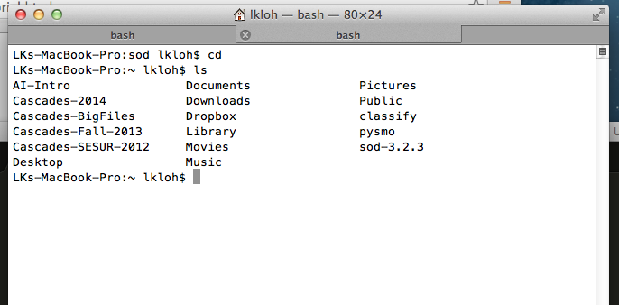

Standing Order for Data (SOD)
=============================

Installing SOD
--------------

First, download `SOD<http://www.seis.sc.edu/sod/index.html/>`_.

Once you have gotten the folder for SOD, put it somewhere where you won't touch it too much. What I did was put the SOD folder in my home directory, though other places are acceptable as well, as long as its not too easy to delete it by accident.

Once you have it there, get the path to the sod folder's bin and put it in your path folder. 
