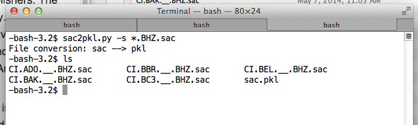

=====================================
SAC Input/Output procedues for AIMBAT
=====================================

Once you have downloaded 

.. ############################################################################ ..
.. #                               SAC -> PKL                                 # ..
.. ############################################################################ ..

Converting from SAC to PKL files
--------------------------------

Place the SAC files you want to convert to a pickle (PKL) file into the same folder. Suppose for instance, they are BHZ channels. Note that the SAC files must be of the same channel. cd into that folder, and run::

	sac2pkl.py -s *.BHZ.sac 

The output should be a PKL file in the same folder as the sac files. 

.. ############################################################################ ..
.. #                               SAC -> PKL                                 # ..
.. ############################################################################ ..
